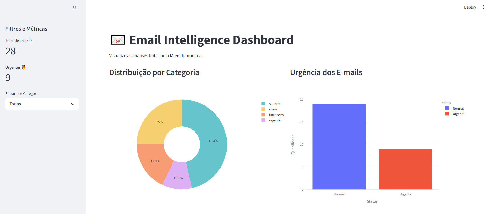
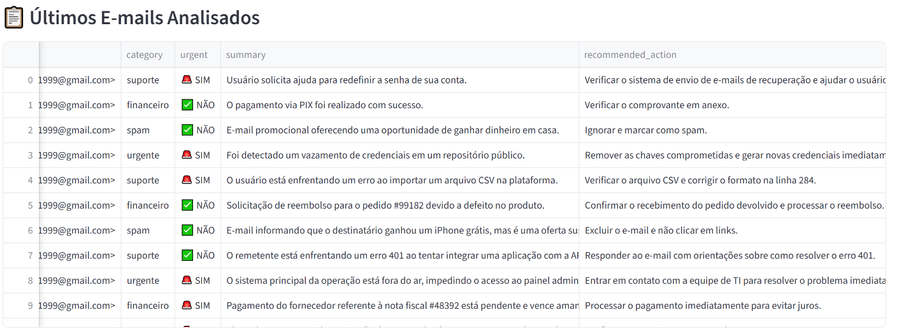
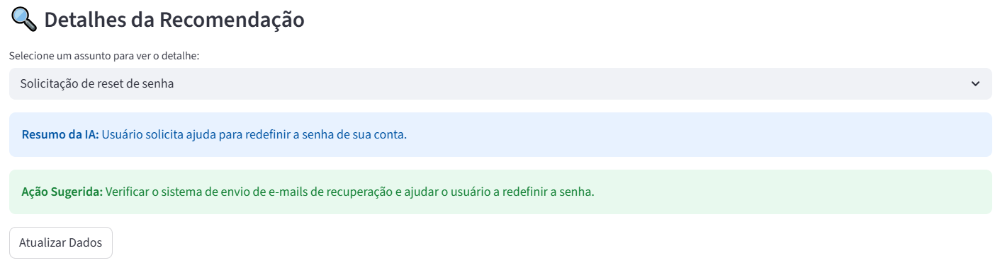

# Email Intelligence Automation System

Sistema de automação inteligente de e-mails com IA, desenvolvido para processamento automático, classificação semântica, extração estruturada de informações e monitoramento operacional em tempo real.



---

## Dashboard Analítico

O sistema possui um dashboard interativo para monitoramento em tempo real dos e-mails processados pela IA.

Nele é possível visualizar:
- categorias identificadas automaticamente
- nível de urgência
- resumos gerados pela IA
- ações recomendadas
- métricas operacionais
- filtros dinâmicos

A interface foi desenvolvida para facilitar análises rápidas e auxiliar tomadas de decisão operacionais.



---

## Recomendação Inteligente com IA

Além da classificação automática, o sistema também gera recomendações contextuais baseadas no conteúdo do e-mail.

A IA:
- resume automaticamente a solicitação
- identifica possíveis riscos
- sugere ações operacionais
- prioriza atendimentos urgentes

Isso permite reduzir trabalho manual e acelerar processos internos.



# Visão Geral

O projeto foi desenvolvido com foco em automação operacional moderna, utilizando Inteligência Artificial para interpretar e processar e-mails reais conectados via IMAP (Gmail/Outlook).

A aplicação realiza:

- leitura automatizada de e-mails
- classificação inteligente utilizando IA
- extração estruturada de dados relevantes
- persistência em banco SQL
- monitoramento via métricas
- orquestração de pipelines
- visualização analítica em dashboard

Além disso, o sistema foi projetado seguindo princípios de backend moderno, observability e arquitetura modular.

---

# Principais Funcionalidades

## Integração com E-mails Reais

Conexão via IMAP para leitura automatizada da caixa de entrada.

---

## Classificação Inteligente com IA

Utiliza OpenAI para categorizar automaticamente os e-mails em:

- financeiro
- suporte
- urgente
- spam

---

## Extração Estruturada

A IA transforma e-mails em dados estruturados:

```json
{
  "categoria": "financeiro",
  "urgente": false,
  "resumo": "Pagamento não confirmado",
  "acao_recomendada": "Verificar status da transação"
}
```

---

## API REST com FastAPI

Endpoints para:
- processamento sob demanda
- consulta de e-mails
- filtros por categoria
- métricas operacionais

---

## Pipeline Orquestrado

Fluxo automatizado utilizando Prefect:
- leitura
- classificação
- processamento
- persistência

---

## Dashboard Analítico

Visualização em tempo real:
- distribuição por categoria
- métricas operacionais
- urgência dos e-mails
- filtros dinâmicos

---

## Observability

- logs estruturados
- métricas Prometheus
- monitoramento de performance
- rastreamento de erros

---

## Containerização

Ambiente totalmente containerizado com Docker e Docker Compose.

---

# Arquitetura do Sistema

```text
Gmail / Outlook
        ↓
   IMAP Reader
        ↓
 OpenAI Processing
        ↓
 Structured Extraction
        ↓
 SQLite Database
        ↓
 FastAPI REST API
        ↓
 Dashboard + Metrics
```

---

# Stack Tecnológica

| Tecnologia | Função |
|---|---|
| Python 3.11+ | Backend principal |
| FastAPI | API REST |
| OpenAI API | Processamento com IA |
| SQLite | Persistência |
| Prefect | Orquestração |
| Prometheus | Métricas |
| Docker | Containerização |
| Plotly/Dash | Dashboard |
| IMAP | Integração com e-mail |

---

# Estrutura do Projeto

```text
email-automation/
│
├── app/
│   ├── api/
│   ├── database/
│   ├── models/
│   ├── monitoring/
│   └── services/
│
├── flows/
├── data/
├── images/
│
├── Dockerfile
├── docker-compose.yml
├── dashboard.py
├── main_api.py
└── requirements.txt
```

---

# Configuração do Ambiente

## Pré-requisitos

- Python 3.11+
- Docker e Docker Compose
- Chave da OpenAI API

---

# Configuração do Gmail (IMAP)

## 1. Ative autenticação em duas etapas

No Google Account.

## 2. Gere uma senha de app

Google → Segurança → Senhas de App.

## 3. Configure o `.env`

```env
OPENAI_API_KEY=your_openai_key

IMAP_SERVER=imap.gmail.com
EMAIL_USER=your_email@gmail.com
EMAIL_PASS=your_app_password
```

---

# Instalação Local

## Linux/macOS

```bash
python3 -m venv venv
source venv/bin/activate
pip install -r requirements.txt
```

## Windows PowerShell

```powershell
python -m venv venv
.\venv\Scripts\Activate.ps1
pip install -r requirements.txt
```

---

# Execução da Aplicação

## API FastAPI

```bash
python main_api.py
```

Swagger:
`http://localhost:8000/docs`

---

## Dashboard

```bash
python dashboard.py
```

Dashboard:
`http://localhost:8050`

---

## Pipeline Prefect

```bash
python flows/email_pipeline.py
```

---

# Docker

## Subir aplicação completa

```bash
docker compose up --build
```

## Rodar em background

```bash
docker compose up -d
```

---

# Endpoints da API

| Método | Endpoint | Descrição |
|---|---|---|
| POST | `/process-email` | Processa um e-mail |
| GET | `/emails` | Lista e-mails |
| GET | `/emails/category/{category}` | Filtra por categoria |
| GET | `/metrics` | Métricas Prometheus |

---

# Observability

O sistema possui monitoramento operacional utilizando Prometheus.

## Métricas coletadas

- total de e-mails processados
- erros de processamento
- tempo de resposta
- requisições IA
- duração de pipelines

## Logs estruturados

Os logs são gerados em JSON para integração com:
- ELK Stack
- Grafana Loki
- sistemas de observabilidade

---

# Exemplo de Fluxo

```text
Novo e-mail recebido
        ↓
Classificação pela IA
        ↓
Extração estruturada
        ↓
Persistência no banco
        ↓
Atualização do dashboard
```

---

# Objetivos do Projeto

Este projeto foi desenvolvido com foco em:

- automação inteligente
- integração com APIs
- engenharia backend
- IA aplicada
- observability
- arquitetura escalável
- pipelines de processamento

---

# Melhorias Futuras

- PostgreSQL
- autenticação JWT
- deploy cloud
- CI/CD
- filas assíncronas
- Kubernetes
- multiusuário

---

# Autor

Gabriel Campanha

Projeto desenvolvido como portfólio técnico para demonstração de competências em:
- automação com IA
- backend engineering
- APIs
- observability
- integração de sistemas
- processamento de dados em tempo real
